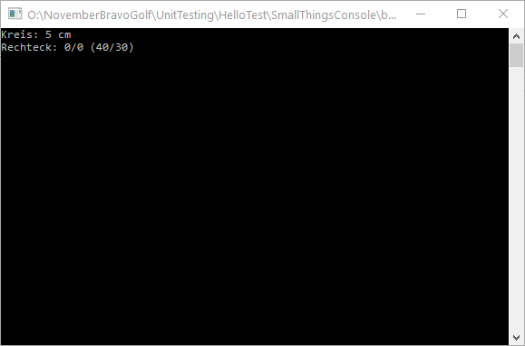
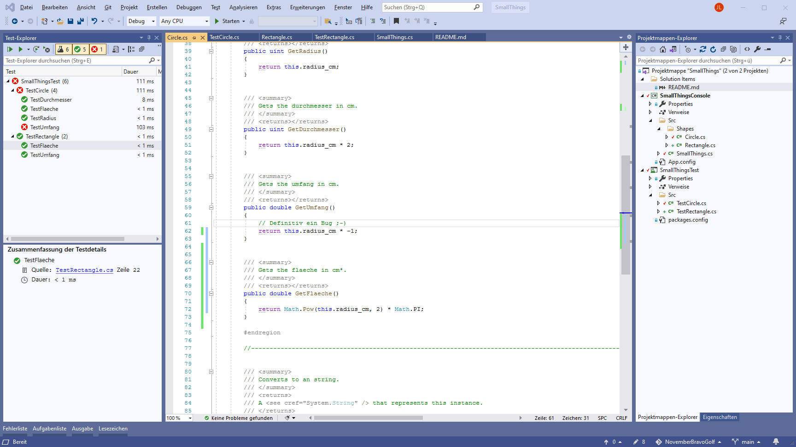

# Small Things

Ein kleines Beispielprojekt mit einem Kreis und einem Rechteck sowie dazugehörige UnitTest's.

---

## Struktur / Gliederung

### Small Things Console (Konsolenanwendung)

Dies ist die ausführbare Hauptanwendung. In der Anwendung gibt es zwei Klassen:

- Rectangle.cs
- Circle.cs

Beider Klassen haben ein minimal Set von Feldern. Diese sind alle `private` und können
nur durch den jeweiligen Konstruktor gesetzt werden.

### Small Things Test (Testprojekt)

Hierbei handelt es sich um das eigentlich Testprojekt. Jede Klasse und jeder Funktion
der Klassen kann getestet werden, ohne die Hauptanwendung starten zu müssen. Dadurch
können auch immer Kombinationen getestet werden, die durch einen normalen Betrieb schwer
erreichbar sind, aber dennoch vorkommen können (Testen der Min/Max Werte für Felder,
negative Werte, allgemein ungültige Werte).

Abhängigkeiten müssen bei dem TestProjekt hinzugefügt sein:

- `MSTest.TestAdapter`
- `MSTest.TestFramework`

---

## Sonstiges

Test Projekte / Source werden nicht mit ausgeliefert:

- Interna von Klassen könnten ungewollt nach außen gelangen.
- TestCode könnte auch wieder Bugs enthalten die zu einem Problem führen.
- Die Abhängigkeiten (DLL's der TestFrameworks) müssten acuh mit ausgeliefert werden.
  > Lizensen, Bug's, Dokumentation ?

---

## Screenshots

*KonsoleExecuted.png*

*VisualStudioTestExplorer.png*
